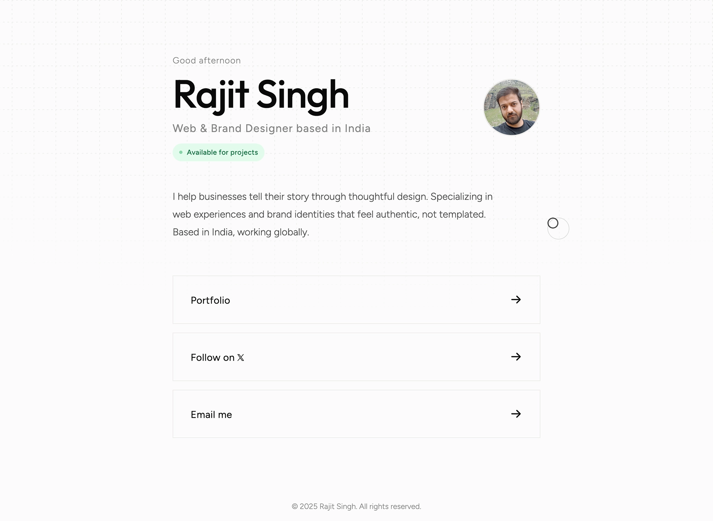

# Rajit Singh - Personal Portfolio

The personal portfolio website of Rajit Singh, a Web & Brand Designer based in India. This site showcases a minimalist, "Swiss-style" design philosophy, emphasizing fluid typography, micro-interactions, and performance.

## ✨ Key Features

### 🎨 Design & UI

- **Minimalist Grid System**: A subtle dashed grid background that expands on load (mask-image animations).
- **Fluid Typography**: Uses modern CSS `clamp()` functions to scale text smoothly between mobile and desktop without rigid breakpoints.
- **Dark/Light Theme**: Automatically adapts to the user's system preference (`prefers-color-scheme`).
- **Custom Cursor**: A custom JS-driven cursor with a trailing "follower" and magnetic pull effects on interactive elements.

### ⚡️ Interactive Elements

- **Time-Aware Greeting**: Automatically welcomes visitors with "Good morning," "Good afternoon," or "Good evening" based on their local time.
- **Bento 404 Page**: A custom error page using a CSS Grid "Bento" layout with a glitch text effect.

### 🛠 Technical Details

- **Zero Dependencies**: Built entirely with Vanilla JavaScript, HTML5, and CSS3. No frameworks.
- **Performance Focused**: Targeted for 100/100 Lighthouse Performance score.
- **Accessibility (A11y)**: Includes `prefers-reduced-motion` queries to disable heavy animations for users who require it.
- **SEO Optimized**: Includes JSON-LD Schema markup for "Person" and Open Graph/Twitter cards for social sharing.

## 🚀 Development

Since this is a static site, no build process is required.

**Clone the repository**

git clone https://github.com/yourusername/portfolio.git

text

**Open the site**

Simply open `index.html` in your web browser.

## 📄 License

© 2025 Rajit Singh. All rights reserved.